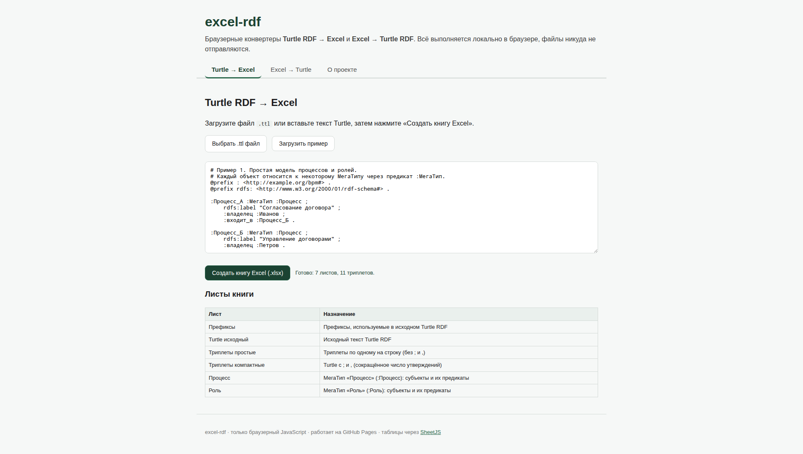
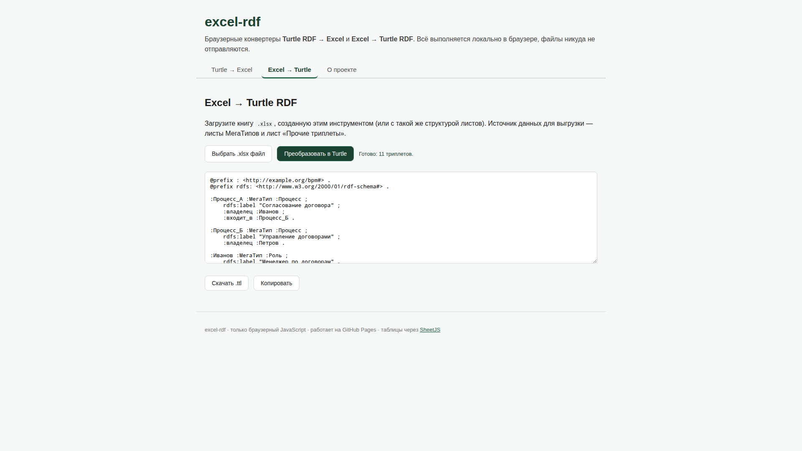

# Документация проекта excel-rdf (ver1)

Браузерные конвертеры **Turtle RDF → Excel** и **Excel → Turtle RDF**. Весь код —
только браузерный JavaScript, без node.js; запуск на GitHub Pages.

- Рабочее приложение: [`ver1/index.html`](../index.html)
- Онлайн (GitHub Pages): `https://bpmbpm.github.io/excel-rdf/ver1/`

## Содержание

- [Как работать с программами](#как-работать-с-программами)
- [Состав книги Excel](#состав-книги-excel)
- [Концепция «МегаТип»](#концепция-мегатип)
- [Обратное преобразование Excel → Turtle](#обратное-преобразование-excel--turtle)
- [Проверки при редактировании (VBA)](#проверки-при-редактировании-vba)
- [Связанные документы](#связанные-документы)
- [Скриншоты](#скриншоты)

## Как работать с программами

### Turtle → Excel
1. Откройте `ver1/index.html` (локально или на GitHub Pages).
2. Вкладка **«Turtle → Excel»**.
3. Загрузите файл `.ttl` (кнопка «Выбрать .ttl файл») или вставьте текст Turtle.
   Можно нажать «Загрузить пример».
4. Нажмите **«Создать книгу Excel (.xlsx)»** — книга скачается автоматически,
   а на странице появится перечень листов.

### Excel → Turtle
1. Вкладка **«Excel → Turtle»**.
2. Загрузите книгу `.xlsx` (созданную этим инструментом или с такой же структурой листов).
3. Нажмите **«Преобразовать в Turtle»** — результат появится в текстовом поле.
4. Кнопкой **«Скачать .ttl»** сохраните результат, либо **«Копировать»**.

## Состав книги Excel

| № | Лист | Назначение |
|---|------|------------|
| 1 | **main** | Перечень листов книги и их назначение |
| 2 | **Префиксы** | Префиксы, используемые в исходном Turtle (`Префикс` → `Пространство имён`) |
| 3 | **Turtle исходный** | Исходный текст Turtle RDF (по строке на ячейку) |
| 4 | **Триплеты простые** | По одному элементарному триплету на строку: `Субъект | Предикат | Объект` (без `;` и `,`) |
| 5 | **Триплеты компактные** | Turtle с `;` и `,` — сокращённое число утверждений |
| 6… | **Листы МегаТипов** | На каждый МегаТип свой лист: строки — объекты, столбцы — предикаты |
| N | **Прочие триплеты** | Триплеты субъектов, не имеющих МегаТипа |

Листы 4 и 5 — два представления одних и тех же данных: «простое» (один триплет на строку)
и «компактное» (с группировкой через `;` и `,`).

## Концепция «МегаТип»

Объект (субъект) относится к некоторому **МегаТипу** через предикат `:МегаТип`:

```turtle
:Процесс_А :МегаТип :Процесс ;
    rdfs:label "Согласование договора" ;
    :владелец :Иванов .
```

Здесь `:Процесс_А` имеет МегаТип `:Процесс`, поэтому он попадает на лист **«Процесс»**.
Столбцы этого листа — все предикаты, встречающиеся у субъектов данного МегаТипа.
На пересечении строки (субъект) и столбца (предикат) стоит значение объекта:

| Субъект | :МегаТип | rdfs:label | :владелец | :входит_в |
|---------|----------|------------|-----------|-----------|
| :Процесс_А | :Процесс | "Согласование договора" | :Иванов | :Процесс_Б |
| :Процесс_Б | :Процесс | "Управление договорами" | :Петров | |

Каждый новый МегаТип создаёт новый лист. Несколько объектов одного предиката
записываются в одной ячейке через запятую (например, `:Сидоров , :Кузнецов`).

Предикат, обозначающий МегаТип, определяется по локальному имени `МегаТип`, поэтому
работают и `:МегаТип`, и `ex:МегаТип`.

## Обратное преобразование Excel → Turtle

Источник данных для выгрузки — **листы МегаТипов** и лист **«Прочие триплеты»**.
Это значит, что пользователь редактирует удобную табличную форму (с фильтрацией и
сортировкой средствами Excel), а затем получает корректный Turtle:

- из каждой строки листа МегаТипа строятся триплеты: `Субъект :МегаТип Тип` плюс
  по триплету на каждое непустое значение предиката-столбца;
- значения с запятыми разбиваются на несколько объектов;
- пустые ячейки пропускаются (предикат у объекта может отсутствовать);
- лист «Прочие триплеты» (`Субъект | Предикат | Объект`) добавляется как есть;
- префиксы берутся с листа «Префиксы».

Если листов МегаТипов в книге нет, конвертер использует лист «Триплеты простые».

## Проверки при редактировании (VBA)

При редактировании листов МегаТипов в Excel модуль
[`ver1/vba/Validation.bas`](../vba/Validation.bas) пересчитывает состояние и выдаёт
подсказки/предупреждения (дубликат предиката, пустой/повторяющийся субъект, некорректный
терм и т.д.). Полное описание — в [`vba-checks.md`](vba-checks.md).

## Связанные документы

- [`linked-data-description.md`](linked-data-description.md) — описание проекта в терминах Linked Data.
- [`examples-description.md`](examples-description.md) — описание примеров из каталога `examples/`.
- [`vba-checks.md`](vba-checks.md) — перечень и описание проверок VBA.
- [`../analysis/`](../analysis) — анализ обоих конвертеров и альтернативная концепция.

## Скриншоты

Turtle → Excel:



Excel → Turtle:


