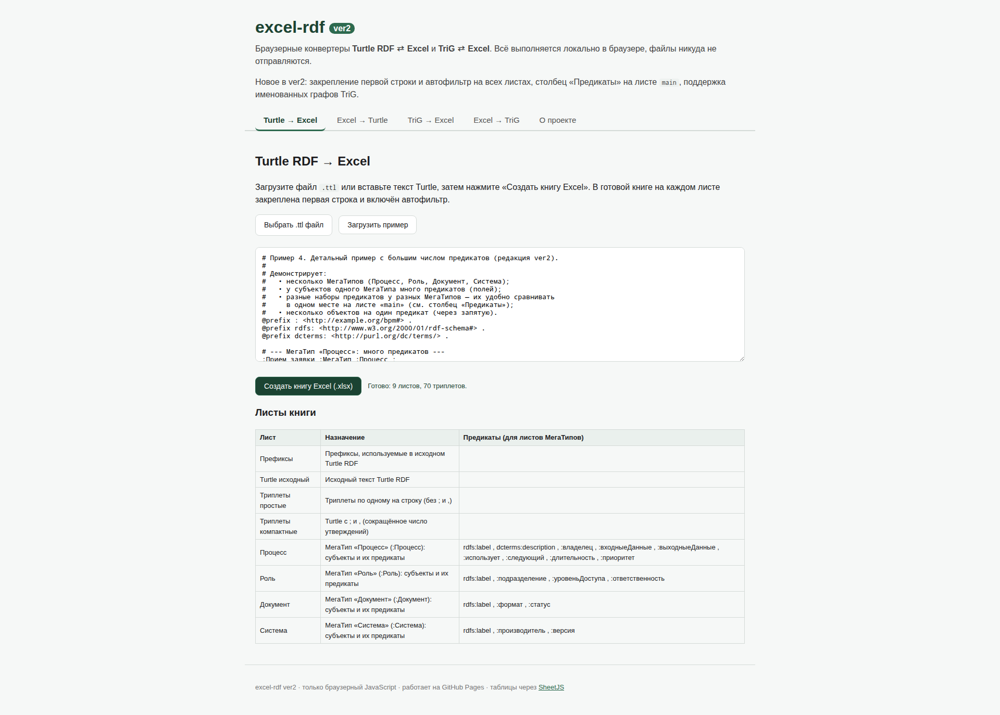
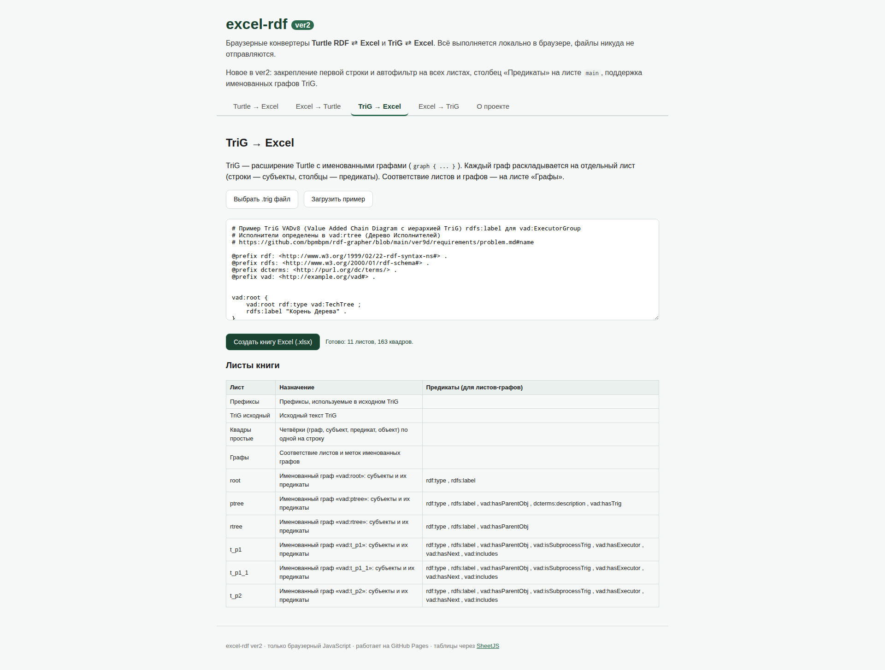
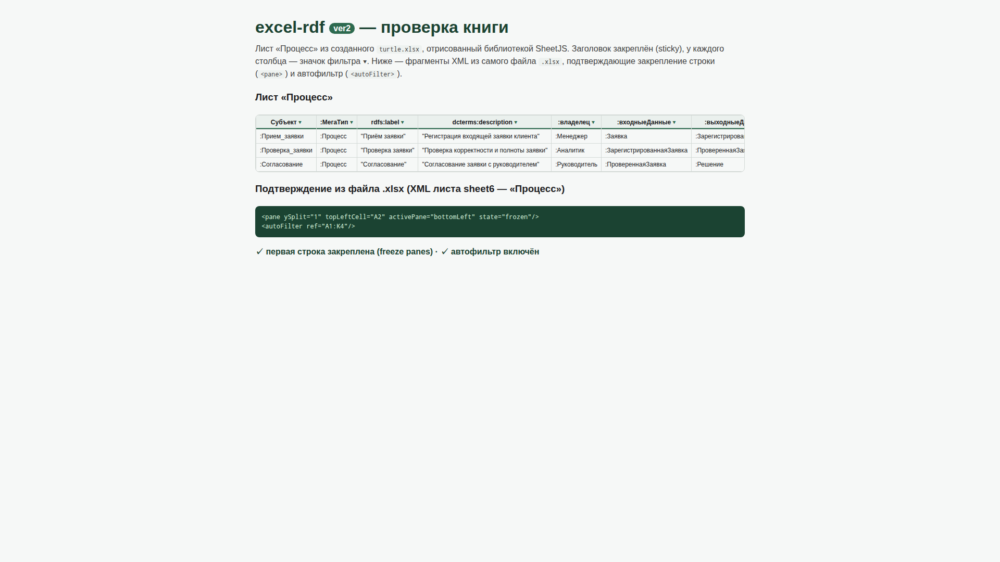

# Документация проекта excel-rdf (ver2)

Браузерные конвертеры **Turtle RDF ⇄ Excel** и **TriG ⇄ Excel**. Весь код —
только браузерный JavaScript, без node.js; запуск на GitHub Pages.

- Рабочее приложение: [`ver2/index.html`](../index.html)
- Онлайн (GitHub Pages): `https://bpmbpm.github.io/excel-rdf/ver2/`

## Что нового в ver2 (относительно ver1)

1. **Закрепление первой строки и автофильтр на каждом листе.** В любой созданной книге
   первая строка закреплена (freeze panes) и снабжена автофильтром — удобно
   просматривать большие таблицы.
2. **Детальный пример с большим числом предикатов** — [`examples/example4.ttl`](../examples/example4.ttl).
3. **Столбец «Предикаты» на листе `main`.** Для каждого листа МегаТипа (или графа TriG)
   в нём перечислены все предикаты (поля) этого листа — наборы предикатов разных
   МегаТипов можно сравнивать в одном месте.
4. **Конвертеры TriG ⇄ Excel.** Отдельная пара преобразований с поддержкой именованных
   графов TriG (`graph { ... }`).
5. **Каталог `ver2/`** с обновлённой документацией в `ver2/doc/` и сопутствующих папках.

## Содержание

- [Как работать с программами](#как-работать-с-программами)
- [Состав книги Excel (Turtle)](#состав-книги-excel-turtle)
- [Концепция «МегаТип»](#концепция-мегатип)
- [Закрепление строки и автофильтр](#закрепление-строки-и-автофильтр)
- [Конвертеры TriG ⇄ Excel](#конвертеры-trig--excel)
- [Обратное преобразование Excel → Turtle](#обратное-преобразование-excel--turtle)
- [Проверки при редактировании (VBA)](#проверки-при-редактировании-vba)
- [Связанные документы](#связанные-документы)
- [Скриншоты](#скриншоты)

## Как работать с программами

### Turtle → Excel
1. Откройте `ver2/index.html` (локально или на GitHub Pages).
2. Вкладка **«Turtle → Excel»**.
3. Загрузите файл `.ttl` (кнопка «Выбрать .ttl файл») или вставьте текст Turtle.
   Можно нажать «Загрузить пример» (загружается детальный `example4.ttl`).
4. Нажмите **«Создать книгу Excel (.xlsx)»** — книга скачается автоматически,
   а на странице появится перечень листов со столбцом «Предикаты».

### Excel → Turtle
1. Вкладка **«Excel → Turtle»**.
2. Загрузите книгу `.xlsx` (созданную этим инструментом или с такой же структурой листов).
3. Нажмите **«Преобразовать в Turtle»** — результат появится в текстовом поле.
4. Кнопкой **«Скачать .ttl»** сохраните результат, либо **«Копировать»**.

### TriG → Excel и Excel → TriG
Аналогично, на вкладках **«TriG → Excel»** и **«Excel → TriG»** (см. ниже).

## Состав книги Excel (Turtle)

| № | Лист | Назначение |
|---|------|------------|
| 1 | **main** | Перечень листов книги, их назначение и (для листов МегаТипов) их предикаты |
| 2 | **Префиксы** | Префиксы, используемые в исходном Turtle (`Префикс` → `Пространство имён`) |
| 3 | **Turtle исходный** | Исходный текст Turtle RDF (по строке на ячейку) |
| 4 | **Триплеты простые** | По одному элементарному триплету на строку: `Субъект | Предикат | Объект` (без `;` и `,`) |
| 5 | **Триплеты компактные** | Turtle с `;` и `,` — сокращённое число утверждений |
| 6… | **Листы МегаТипов** | На каждый МегаТип свой лист: строки — объекты, столбцы — предикаты |
| N | **Прочие триплеты** | Триплеты субъектов, не имеющих МегаТипа |

На листе **main** теперь три столбца: `Лист`, `Назначение`, `Предикаты (для листов МегаТипов)`.
В третьем столбце для каждого листа МегаТипа перечислены все его предикаты — это позволяет
сравнивать наборы полей разных МегаТипов в одном месте.

## Концепция «МегаТип»

Объект (субъект) относится к некоторому **МегаТипу** через предикат `:МегаТип`:

```turtle
:Процесс_А :МегаТип :Процесс ;
    rdfs:label "Согласование договора" ;
    :владелец :Иванов .
```

Здесь `:Процесс_А` имеет МегаТип `:Процесс`, поэтому он попадает на лист **«Процесс»**.
Столбцы этого листа — все предикаты, встречающиеся у субъектов данного МегаТипа.
На пересечении строки (субъект) и столбца (предикат) стоит значение объекта:

| Субъект | :МегаТип | rdfs:label | :владелец | :входит_в |
|---------|----------|------------|-----------|-----------|
| :Процесс_А | :Процесс | "Согласование договора" | :Иванов | :Процесс_Б |
| :Процесс_Б | :Процесс | "Управление договорами" | :Петров | |

Каждый новый МегаТип создаёт новый лист. Несколько объектов одного предиката
записываются в одной ячейке через запятую (например, `:Сидоров , :Кузнецов`).
Запятые внутри литералов (`"текст, с запятой"`) разделителями не считаются.

Предикат, обозначающий МегаТип, определяется по локальному имени `МегаТип`, поэтому
работают и `:МегаТип`, и `ex:МегаТип`.

## Закрепление строки и автофильтр

Во всех создаваемых книгах на каждом листе:

- **закреплена первая строка** (freeze panes) — заголовки не уходят при прокрутке;
- **включён автофильтр** — у каждого столбца появляется выпадающий список фильтра.

Технически: библиотека SheetJS (community edition) умеет записывать автофильтр, но
**не** умеет записывать закрепление областей. Поэтому freeze panes добавляется модулем
[`js/xlsx-extras.js`](../js/xlsx-extras.js): после сборки `.xlsx` (ZIP без сжатия) в каждый
файл листа `xl/worksheets/sheetN.xml` вставляется элемент `<pane>`, после чего архив
пересобирается. Внешних зависимостей для этого не требуется.

## Конвертеры TriG ⇄ Excel

**TriG** — расширение Turtle, добавляющее именованные графы:

```trig
vad:ptree {
    vad:p1 rdf:type vad:TypeProcess ;
        rdfs:label "p1 Процесс 1" ;
        vad:hasParentObj vad:ptree .
}
```

Триплеты внутри `graphLabel { ... }` относятся к именованному графу, триплеты вне скобок —
к графу по умолчанию. В книге Excel каждый граф раскладывается на отдельный лист
(строки — субъекты графа, столбцы — предикаты).

Состав книги TriG:

| № | Лист | Назначение |
|---|------|------------|
| 1 | **main** | Перечень листов книги, их назначение и (для листов-графов) их предикаты |
| 2 | **Префиксы** | Префиксы, используемые в исходном TriG |
| 3 | **TriG исходный** | Исходный текст TriG (по строке на ячейку) |
| 4 | **Квадры простые** | По одной четвёрке `Граф | Субъект | Предикат | Объект` на строку |
| 5 | **Графы** | Соответствие листов и меток именованных графов (используется при обратной сборке) |
| 6… | **Листы графов** | На каждый именованный граф свой лист: строки — субъекты, столбцы — предикаты |

Пример TriG — [`examples/trig-vad.trig`](../examples/trig-vad.trig)
(взят из [rdf-grapher/ver9d](https://github.com/bpmbpm/rdf-grapher/blob/main/ver9d/dia/Trig_VADv8.ttl)).

При обратном преобразовании (Excel → TriG) источник истины — **листы графов**, перечисленные
на листе **«Графы»**; если карта графов отсутствует, используется лист «Квадры простые».

## Обратное преобразование Excel → Turtle

Источник данных для выгрузки — **листы МегаТипов** и лист **«Прочие триплеты»**.
Это значит, что пользователь редактирует удобную табличную форму (с фильтрацией и
сортировкой средствами Excel), а затем получает корректный Turtle:

- из каждой строки листа МегаТипа строятся триплеты: `Субъект :МегаТип Тип` плюс
  по триплету на каждое непустое значение предиката-столбца;
- значения с запятыми разбиваются на несколько объектов (кроме запятых внутри литералов);
- пустые ячейки пропускаются (предикат у объекта может отсутствовать);
- лист «Прочие триплеты» (`Субъект | Предикат | Объект`) добавляется как есть;
- префиксы берутся с листа «Префиксы».

Если листов МегаТипов в книге нет, конвертер использует лист «Триплеты простые».

## Проверки при редактировании (VBA)

При редактировании листов МегаТипов в Excel модуль
[`ver2/vba/Validation.bas`](../vba/Validation.bas) пересчитывает состояние и выдаёт
подсказки/предупреждения (дубликат предиката, пустой/повторяющийся субъект, некорректный
терм и т.д.). Полное описание — в [`vba-checks.md`](vba-checks.md).

## Связанные документы

- [`linked-data-description.md`](linked-data-description.md) — описание проекта в терминах Linked Data.
- [`examples-description.md`](examples-description.md) — описание примеров из каталога `examples/`.
- [`vba-checks.md`](vba-checks.md) — перечень и описание проверок VBA.
- [`../analysis/`](../analysis) — анализ обоих конвертеров и альтернативная концепция.

## Скриншоты

Turtle → Excel:



TriG → Excel:



Книга Excel с закреплённой строкой и автофильтром:


